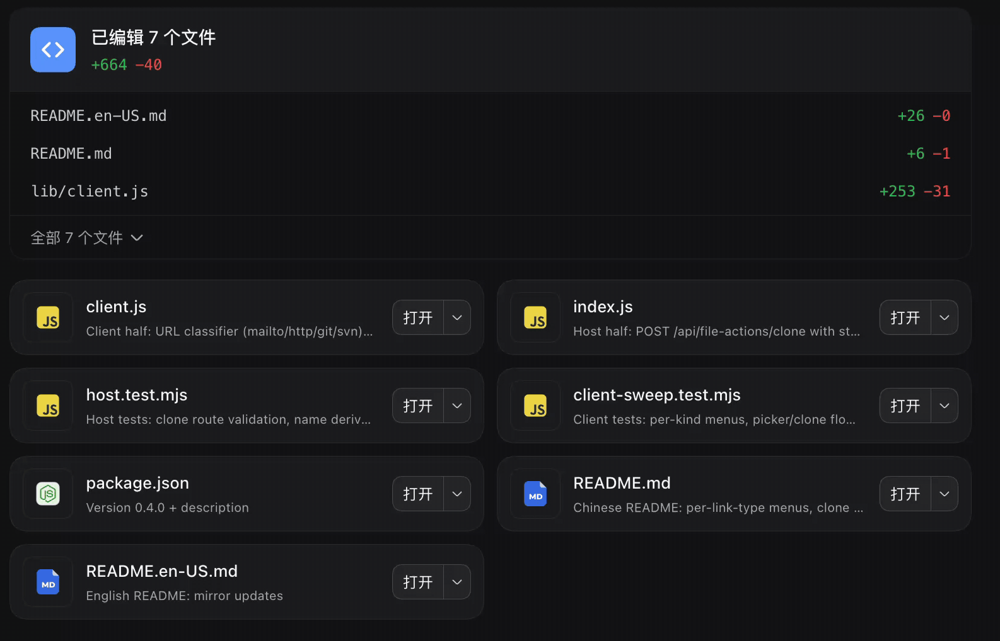
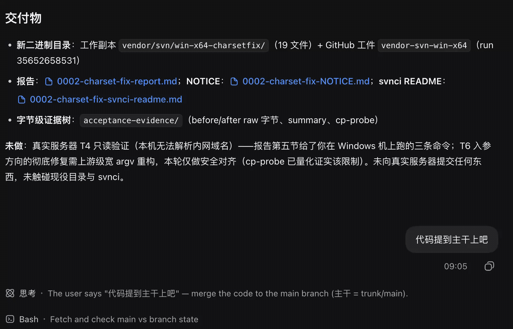

<div align="center">

# dsh-plugin-file-actions

**Copy paths, open files in your editor, run them in a terminal — right from
every presented-file card in the DSH web GUI. macOS / Windows / Linux.**

English · [简体中文](README.md)

[](./LICENSE)
[](#-known-limitations)
[](https://github.com/deepseek-ai/deepseek-harness)

</div>

## 🎬 Demo

**File-card dropdown menu** — click the card's ▾: copy paths, open in an editor, the file manager, or a terminal

[](docs/file-actions.gif)

**In-session link context menu** — right-click a link in a message for a type-aware menu: file / `mailto:` / web / git / svn

[](docs/link-actions.gif)

## ✨ Features

A dual-face DeepSeek Harness plugin that extends the dropdown menu of every
**presented-file card** (the file list a session delivers at the end of a turn)
in the DSH web GUI:

- 📋 **Copy relative path** / **Copy absolute path** — one click each
  (browser-side, every platform), closing the menu at the bottom.
- 🚀 **Open the file in a detected editor or IDE** — VS Code, Cursor, Sublime
  Text, the JetBrains family, and more, each shown with its real application
  icon. Detection and launching reuse the official `open-in-app` resolver:
  macOS checks `.app` bundles, Windows checks the registry (`App Paths`,
  Uninstall records, `%ProgramFiles%` scans), Linux checks PATH names and
  desktop entries.
- 📂 **Open the containing folder in the file manager** — Finder (macOS) /
  File Explorer (Windows) / Files (Linux), with the real application icon,
  through the official `POST /open-in-app/open` route — exactly what the
  session-header dropdown does.
- ▶️ **Run this file in a terminal** / **Open its containing folder in a
  terminal** — a submenu per detected terminal: Terminal.app / Ghostty on
  macOS, Windows Terminal / Git Bash on Windows, GNOME Terminal / Konsole /
  Ghostty on Linux.
- 🖱️ **The same menu on the file links inside session messages** — right-click
  a file link rendered in a message (file mentions / markdown file links, the
  path rides in the `title`) and the same menu opens at the cursor. The
  workspace directory comes from the viewed session's `cwd`, which relative
  paths resolve against. The official left-click preview behavior is
  untouched. On touch devices the same menu opens on long-press (see
  "Mobile (touch)" below).
- 🔗 **Per-link-type right-click menus** — `mailto:` offers **copy email
  address / compose email**; http(s) links offer **copy link / open in the
  built-in browser / open in browser** (the built-in entry appears only when
  the deployment ships the browser tab, opening through the official
  `sidebarRight` service); git repository URLs (`.git` suffix, `git@host:path`,
  `git://`, `ssh://` — as anchors or inline code) offer **copy link / clone
  to…**; svn URLs (the `svn://` family, inline code) offer **copy link / check
  out to…**. Clone/checkout first opens the official directory picker for the
  parent directory, then the host runs `git clone` / `svn checkout` with argv
  straight to the executable — no shell, and the URL is strictly validated
  first (leading dashes, whitespace, and overlong strings are refused, closing
  the option-injection door). The target directory is the URL's last segment.

> [!NOTE]
> The two original official card entries are not kept: "open with the default
> application" is covered by the detected editor list (the listed apps are the
> common default apps, and there is no way to predict what the default app
> actually is), and "show in the file manager" moves into the application list
> above — same real icon, same official route. Against the official app
> whitelist, the card menu's only additions are the two copy-path entries.

## 🧩 How the application list is decided

The plugin aligns with the official `open-in-app` mechanism — the **official
resolver probed against the local machine**, no configuration:

- The host half loads the resolver library straight out of the official
  `@deepseek-ai/dsh-host-open-in-app` package (exact-pinned), resolves every
  application through the exact locator chains the official routes use, and
  launches the resolved executable with the file path appended (`open -a
  <bundle> <file>` on macOS, a direct spawn of the resolved exe on
  Windows/Linux). When the official catalog gains an app or revises a locator
  spelling, the plugin follows with a release upgrade.
- Editors and terminals take a **double intersection**: the browser half
  intersects the official probe result (`GET /open-in-app/apps`) with the
  **local resolution result** the plugin's own info route reports
  (`available`): an app appears only when the official probe verified it, the
  plugin's resolver resolved it, and it is whitelisted — so even a version
  skew between the plugin's resolver copy and the host dsh's can never
  reproduce "the menu shows it, the click 400s". Newly installed apps appear
  after the next `dsh web` restart; uninstalled apps disappear immediately.
- The file-manager entry **follows the official probe alone** (macOS `finder`
  / Windows `explorer` / Linux `filemanager` — first in the official
  catalog's menu order): its launch is the official `POST /open-in-app/open`
  with the file's directory — the exact call the session-header split button
  makes — so the official route itself is the complete "menu shows it, the
  click works" guarantee; no plugin-side intersection applies.
- Icons come from the official icon route (`GET /open-in-app/icon/<id>`) — the
  same real application icons as the session header (extracted from the
  executable on Windows); a generic glyph stands in when missing.

Terminal entries carry a hover submenu: **Run this file in a terminal** (the
command comes from the extension map below; unmapped extensions grey the item
out) and **Open its containing folder in a terminal** (forwarded to the
official `POST /open-in-app/open` route with the parent directory).

### 📱 Mobile (touch)

On phones and tablets (`pointer: coarse`) two pieces adapt:

- **Long-press opens the link menu** — touch has no right-click: iOS never
  fires `contextmenu` for a hold (its native behavior is the link-preview
  callout), so over the message flow the plugin opens the same menu on a
  **~0.5 s long-press**, and the release is swallowed so no synthesized click
  follows the link. The iOS preview callout and the selection loupe are
  suppressed for message links and inline code (`-webkit-touch-callout` /
  `user-select`, scoped to the conversation flow, injected under a
  `data-plugin` style tag and torn down with HMR). Android's native
  `contextmenu` long-press path keeps working and is de-duplicated against the
  new press timer.
- **Terminal submenus flatten** — the official Menu primitive opens submenus
  beside the parent row with no viewport clamp, so on a 390px phone the side
  card lands off-screen (measured at x 362..540), and touch has no hover
  anyway. On touch the terminal actions flatten into the top level: **Run this
  file in {terminal}** / **Open its containing folder in {terminal}**, one row
  per action naming the terminal. Desktop keeps the hover submenu.

## 📦 Install

### Prerequisites

- **dsh** reachable — `dsh --version`, or prefix every command below with
  `npx @deepseek-ai/dsh`
- **pnpm** on PATH (the dsh plugin manager calls it): `npm install -g pnpm`

### 1. Add the plugin

```sh
# local directory (link: — source edits apply directly)
# ⚠️ run npm install inside the checkout first for link: installs:
#    plugin dependencies resolve from the checkout's own node_modules
npm install    # in the checkout (skip for npm/git installs — pnpm brings the deps)
npx @deepseek-ai/dsh plugin --profile web add link:/absolute/path/to/dsh-plugin-file-actions -w

# from GitHub
npx @deepseek-ai/dsh plugin --profile web add git+https://github.com/cholf5/dsh-plugin-file-actions.git -w
```

### 2. Restart and refresh

Restart `dsh web`, then refresh the browser page (hard refresh after updates).

### 3. Verify (optional, but recommended)

Verify the route with a cookie — an unauthenticated 401 happens for every
`/api` path and proves nothing about registration:

```sh
curl -s -c /tmp/dsh-cookies.txt "http://127.0.0.1:3080/?token=<token-from-launch-url>" -o /dev/null   # mint session cookie (303)
curl -s -b /tmp/dsh-cookies.txt http://127.0.0.1:3080/api/file-actions/info   # JSON body = registered; 404 "not found" = not
```

<details>
<summary>No pnpm, and don't want it? Manual fallback</summary>

```sh
git clone https://github.com/cholf5/dsh-plugin-file-actions.git ~/.dsh/profiles/web/node_modules/dsh-plugin-file-actions
```

Then edit `~/.dsh/profiles/web/cordis.patch.yml` so the top-level list contains
(this is the file's final state — do not blindly append after a `[]` line):

```yaml
- insert:
    - id: file-actions
      name: dsh-plugin-file-actions
```

The running dsh hot-loads this row (patch file watch); refresh the browser
afterwards.

</details>

<details>
<summary>Update / remove</summary>

```sh
npx @deepseek-ai/dsh plugin --profile web update dsh-plugin-file-actions -w    # or remove
```

Restart `dsh web` afterwards.

</details>

### 🩺 Troubleshooting

| Symptom | Cause & fix |
|---|---|
| `dsh: command not found` | npx-only install — prefix `npx @deepseek-ai/dsh` |
| `pnpm was not found` (exit 127) | `npm install -g pnpm`, or use the manual fallback |
| `ERR_PNPM_ADDING_TO_ROOT` | the `-w` flag was dropped |
| Installed but the UI is unchanged | restart `dsh web` (bundle layers don't hot-reload), then refresh the page |
| The extended menu never appears on cards | fiber probing failed and the plugin fell back to the official chevron (see known limitations); check the DevTools console first |
| `dsh web` boot log shows a `file-actions:` error, or `Cannot find package '@deepseek-ai/dsh-host-open-in-app'` | the official dependency is missing or unresolvable — for `link:` installs run `npm install` inside the checkout; for npm/git installs reinstall with `dsh plugin --profile web update dsh-plugin-file-actions -w` |
| An editor/terminal is missing from the menu | the app was not verified by BOTH the official probe and the plugin's own resolution (does it appear in the official split-button menu?) — both intersections must pass. The file manager follows the official probe alone: if the official split-button menu has it, the card menu will too |

## ⚙️ Configuration

The host row accepts:

```yaml
- insert:
    - id: file-actions
      name: dsh-plugin-file-actions
      config:
        runCommands:              # extension (no dot) → command run ahead of the quoted file path
          py: python3             # defaults are platform-aware: Windows defaults to python / cmd /c / powershell -File, etc.
          sh: bash
          js: node
          ts: tsx
        allowExecutableBit: true  # also offer "run" for unmapped extensions that carry an execute bit
        launchTimeoutMs: 10000    # deadline for bounded host commands, and the detached-launch watch window
        cloneTimeoutMs: 120000    # deadline for one git clone / svn checkout (network-bound, ceiling far above the launch watch)
```

> [!WARNING]
> Override in the profile's own `cordis.patch.yml` — a patch row replaces the
> target row's whole `config` (no deep merge), so restate every key you need.

## 🔍 How it works

| Layer | File | Runs in |
| --- | --- | --- |
| Host | `lib/index.js` | Node — the Cordis Loader |
| Client | `lib/client.js` | Browser — the dsh client module system |

### Host — `lib/index.js`

The `file-actions` Cordis row registers four exact routes on the shared
authenticated `/api` channel:

| Route | Behavior |
| --- | --- |
| `GET /api/file-actions/info` | registration probe — a JSON body proves the plugin is loaded |
| `POST /api/file-actions/launch` | resolve the app through the official resolver → `launchResolved` with the file path appended (one re-resolution on a missing executable, official semantics) |
| `POST /api/file-actions/run` | build the terminal command per the table below and launch detached |
| `POST /api/file-actions/clone` | validate the repository URL (VCS shape + option-injection screening) → argv `git clone` / `svn checkout` into the derived subdirectory |

Terminal adapters (all spawned detached through the official launcher with a
credential-scrubbed environment; the terminal outlives dsh):

| Terminal | Platform | Mechanism |
| --- | --- | --- |
| Terminal.app | macOS | AppleScript `do script "cd <dir> && <command>"` |
| Ghostty | macOS / Linux | macOS `open -na Ghostty --args -e`; Linux `ghostty --working-directory=<dir> -e bash -c` |
| Windows Terminal | Windows | `wt -d <dir> cmd /k` with the command line passed through the `%FILE_ACTIONS_RUN_CMD%` environment variable — the token holds no whitespace, so wt's command-line reconstruction cannot mangle it, and cmd expands it at execution time |
| Git Bash | Windows | `<Git>/usr/bin/mintty.exe -e <Git>/usr/bin/bash.exe -l -c "cd <dir> && <command>; exec '<Git>/usr/bin/bash.exe' -l -i"` (the shells always run by absolute path — a bare `exec bash` resolves through the Windows PATH to WSL's `system32\bash.exe`; `CHERE_INVOKING=1` keeps the login shell from cd-ing home) |
| GNOME Terminal / Konsole | Linux | `--working-directory` / `--workdir` + `bash -c "<command>; exec bash -i"` |

POSIX terminals keep an interactive shell after the command ends (matching
Terminal.app's behavior); every route asks the composition's `connection`
service for a rejection first — the same trust fence as the official
open-in-app host.

### Client — `lib/client.js`

A MutationObserver watches presented-file cards (`[data-presented-file]`),
reads the card's React fiber for `file` / `cwd` / `onAction` / locale, hides
the official chevron, and mounts a style-consistent plugin menu button.

The right-click menu is pure event delegation: a document-level `contextmenu`
listener matches the file-link buttons the official markdown renders (file
mentions and markdown file links share one hashed class and carry the path in
their `title`; the input area's reference chips share the class but mark
themselves with `data-ref-chip` and are excluded). On a match it prevents the
native menu and opens the plugin menu at the cursor through the Menu
primitive's `getAnchorRect` (portal mode). On touch devices a long-press
detector (`touchstart`/`touchmove`/`touchend`) feeds the same open path — see
"Mobile (touch)" above. The viewed session's workspace
directory is published by an empty cell occupying the official
`conversation.session.header.utilities` slot — the same seat and the same
standard props (`sessionId` + `useSessions`) the official open-in-app button
consumes. The URL menu's optional capabilities (built-in browser tab,
directory picker) are read the way official client plugins do it: declared in
`exports.inject` as `remote` / `remote.directoryPicker` first — reading an
undeclared service trips cordis's `cannot get property ... without inject`
guard and crashes the whole menu render.

> [!IMPORTANT]
> If the fiber cannot be read (upstream DOM or React changes), the official
> chevron stays in place — the plugin degrades to invisible instead of breaking
> the card.

## 🚧 Known limitations

- **The application catalog is fixed**, aligned with the official open-in-app
  philosophy: deployers cannot add their own editors from cordis.yml; extending
  the table means extending the host's `EDITOR_IDS`/`TERMINALS` (or the
  client's `FILE_MANAGER_IDS`) and the client dictionaries. What appears is
  decided entirely by the official probe (the official catalog declares no
  win32 locators for Zed, so Zed never shows on Windows, for example).
- **Run commands are recognized by extension.** Unmapped extensions get the
  "run" offer based on executability: POSIX consults the execute bit (which the
  client cannot see), Windows derives it from the extension
  (`.exe`/`.bat`/`.cmd`/`.com` — chmod has no effect there; `.bat`/`.cmd` map
  to `cmd /c` by default). Extension-less files get no "run" offer on Windows.
  Configure `runCommands` when needed.
- **Windows Terminal run commands go through cmd.** The command string is
  executed by `cmd /k`, so cmd metacharacters in configured values are
  expanded; run `.sh` scripts in the Git Bash terminal instead (its command
  executes in an MSYS bash context). Git Bash "run" relies on the mintty that
  ships with a full Git for Windows install.
- **The official dependency is exact-pinned.** The host locates
  `@deepseek-ai/dsh-host-open-in-app`'s `lib/types/resolver.js` through its
  package manifest (shipped in the published tarball, with multiple layouts
  tried per version); the dependency is pinned to `0.1.6-alpha.2` and does not
  drift on `dsh plugin update`. The host dsh carries its own resolver copy —
  any skew between the two is bridged by the client's double intersection
  (official probe ∩ plugin resolution). If a future version changes the
  layout, the plugin fails loudly at activation with a `file-actions:` error
  instead of silently degrading.
- **Fiber-based augmentation.** If a dsh upgrade changes the presented-file
  card internals, the menu may stop appearing (the official chevron is restored
  automatically); updating the fiber probe and selectors restores it.
- **The right-click menu depends on the official file-link DOM shape.** The
  match condition is "the `fileMention` hashed class + the path in `title`" on
  a button; if a dsh upgrade changes the markdown rendering (class renamed,
  path moved elsewhere), the context menu silently stops appearing (plain
  right-clicks keep working); updating `FILE_LINK_SELECTOR` restores it. File links
  rendered outside the viewed session's context resolve their paths against
  the currently viewed session's `cwd`.
- **URL menus only recognize what the official renderer links.** The official
  sanitizer keeps only http/https/mailto hrefs, so `svn://` and `git@` URLs
  are recognized in their inline-code form (the whole code text being the
  repository URL); URLs bare in plain text have no reliable boundary and are
  not menu targets. svn-over-http(s) is indistinguishable from a web page and
  gets the http menu.
- **Cloning writes to the host filesystem — the same trust tier as "run this
  file in a terminal".** The URL comes from chat text; the host spawns argv
  straight to the executable and first refuses anything that could parse as
  an option (leading dash), holds whitespace, or is overlong. Private repos
  fail fast instead of hanging the bounded command (`GIT_TERMINAL_PROMPT=0`);
  cached credential helpers and agent keys keep working.

## 🛠️ Development

```sh
npm install
node --test
```

`node --test` discovers and runs all three test files under `test/`. The tests
inject seams (resolver / launcher / runCommand / stat / platform) to cover the
win32, linux, and darwin adapters deterministically on any development machine —
including the execute-bit fallback that reads a POSIX mode (the stat seam fakes
the mode, no chmod involved) — plus one integration test that loads the real
official resolver library. `client-sweep.test.mjs` additionally drives the real
`apply()` against a minimal fake DOM to regression-sweep the client half —
covering the DOM-structure class of bugs a stubbed `require` cannot catch, such
as the container having to land outside the official chevron's `span.menuAnchor`
wrapper (0.1.6+ behavior), or the whole menu vanishes with its `display:none`.

> [!TIP]
> With a `link:` install, edits to `lib/client.js` hot-swap into the running
> `dsh web` without a restart; host-half changes need a restart — and the
> checkout must have `npm install` run first (dependencies resolve from the
> checkout's `node_modules`).

## 📄 License

[MIT](./LICENSE) © cholf5
